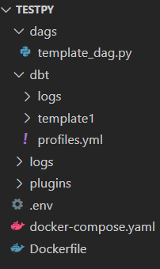

# MysteryMachine
Welcome to mmachine! 

Mystery Machine is a tool that allows users to build a full data engineering project environment
just by writing one line of code, making dbt more accessible

It works by launching airflow on docker-compose and sets up a dbt project while smoothly moving dependencies,
exposing the config files and thus allowing users to easi for your project configurations

## Quickstart

### Installation

Right now mmachine is on test mode and can be installed via PyPitest:

`
pip install -i https://test.pypi.org/simple/ mmachine
`

## Commands

The current version of mmachine has 3 commands:

- `
mmachine init
`
  create a new DE project environment in the directory you are currently in

- `
mmachine dbt
`
  create a new Dbt Project

- `
mmachine close
`
  closes your running docker-compose instances

## Run

when running 
`
mmachine init
`
 on a folder mmachine will:

 - spin up an airflow instance on docker-compose, reachable via localhost:8080, user&pw 'mmachine'
 - create a template with a dbt run command ready to fire
 - create a dbt template project and move the profiles.yml file to the volume so that users can easily access it(the template uses a connection to postgres)

after it has finished running you will only need to set up your connection in the profiles.yml and the dag will be ready to run

If you need to create a dbt project that uses snowflake, redshift or bigquery you can by using 
`
mmachine init
`
